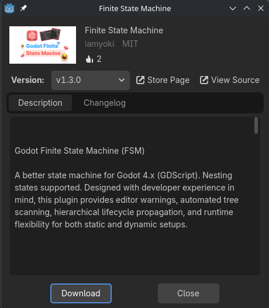
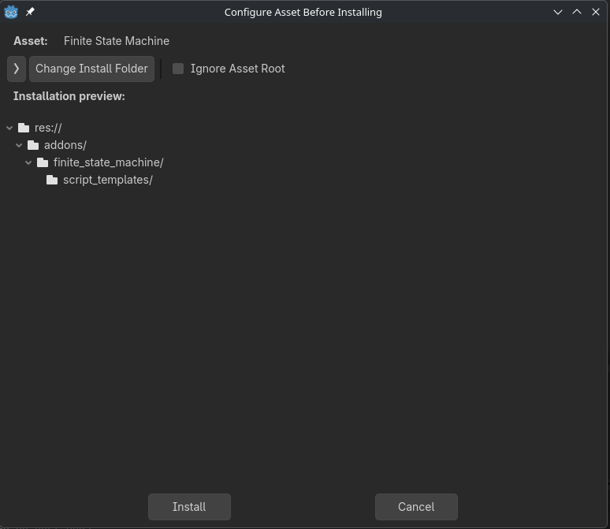
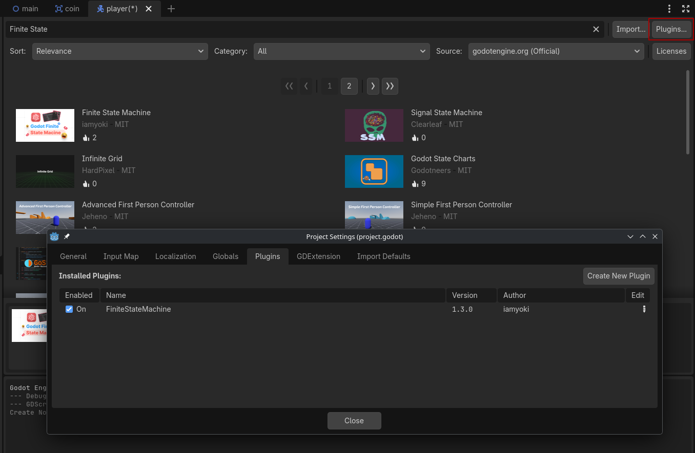
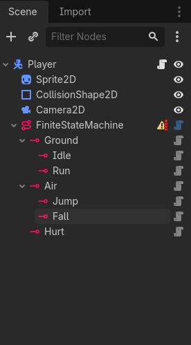
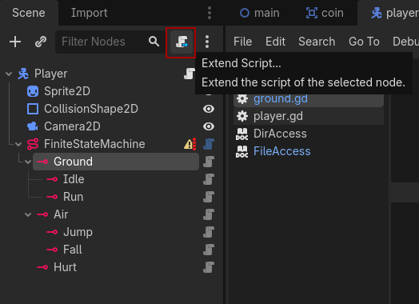
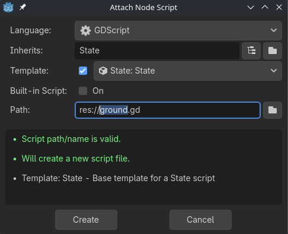

Godot's default movement script for the CharacterBody2D node provides many of the basic functions we might need a player controlled entity to have. However, we will often have complex behaviors that we may need to organize and control transitions between. To do this we can use a *Finite State Machine*. Godot doesn't have a built in Finite State Machine but its included Asset Library has many available to use. For this assignment we will be using the "Finite State Machine" addon by iamyoki. You can find this in the AssetLib tab by searching "Finite State Machine":


We can include the addon in our project by selecting it in the Asset Store, clicking download, and then clicking install:





The last thing we need to do is make sure the plugin is active. We'll do this in the Asset Store by clicking the "Plugins..." button and enabling the "FiniteStateMachine" plugin:



Now let's talk more about what a Finite State Machine is.

## Finite State Machines: Setting up States

A State is a discrete set of instructions that an entity will follow. An entity can only be in one State at a time, though they can have as many States as are needed for the behaviors of the entity. For example, if we are defining the states of a "Player" entity we may have the following states with the attached behaviors:

* Idle
	* In this state the player is not moving
	* Plays the "idle" animation
* Run
	* Player can move left and right using the A and D keys
	* Plays the "run" animation
* Jump
	* Propels the player upward 
	* Player can move left and right using the A and D keys
	* Plays the jump animation
* Fall
	* The player can move left and right using the A and D keys
	* Plays the Fall animation
* Hurt
	* Reduces the player's health by 10
	* Pushes the player away from the source of damage
	* Stops the player from taking more damage while in the state

Our FiniteStateMachine plugin considers each state as a Node (a State Node to be exact) and allows us to nest states that have shared behaviors. For instance, we may have shared behaviors in our states on the ground (Idle and Run). And our states in the air (Jump and Fall). We can organize our states in this way:

* Ground 
	* Idle
	* Run
* Air
	* Jump
	* Fall
* Hurt

These states will be connected to a FiniteStateMachine node. Here's what that should look like in the scene tree:



We can then define the behavior in a state by *extending* its script. We do this in the same way that we add a script to a node by selecting it in the scene tree and clicking the script icon:



We should have an option for a default script template, if this appears you can create the script:



If the template does not appear, you can create a blank script and replace all the code in the script with the following:

```python
extends State

# Runs once when state is entered
func enter():

	pass

# Runs every process cycle
func update(delta: float):

	pass

# Runs every physics process cycle
func physics_update(delta: float):

	pass

# Runs once when state is exited
func exit():

	pass
```

We will do this for *all* of our states. Once we've created all of our states and extended their scripts we can select an initial state in the Inspector for the FiniteStateMachine node (let's select "Idle"). After we've completed all of these steps we're ready to start coding!


## State Logic

Each state has four functions that it can run: enter(), update(), physics_update(), and exit(). Both enter() and exit() run once while update() runs on every process cycle and pysics_update() runs on every physics process cycle. We can use update() the same way that we use _process() in other scripts. For example, we may want to have a state that changes the position of a node every frame. We would need to do a few things first:

* Get a reference to the node in our script
* If the target node has a script on it, make sure its script does not conflict with our state's behavior

And here's an example of what the code for such a behavior would look like:

```gdscript
extends State

@onready var player: CharacterBody2D = $"../.."

# Runs once when state is entered
func enter():

	pass

# Runs every process cycle
func update(delta: float):
	player.position.x += 50 * delta 
	pass

```

Nested states will run both their functions as well as their *parent's* functions. This allows for states to have *shared behaviors*. For example, we may want to have a state that moves the player to the left as well, but both states also move the player up as well. To do this we could use a parent state (we'll call it movement in this case), and then attach two states to it like so:

* Movement
	* Left
	* Right

The Movement/Right state would have the previous code in it while the Movement/Left state would have the following:

```python
# The Movement/Left State
extends State

@onready var player: CharacterBody2D = $"../.."

# Runs once when state is entered
func enter():

	pass

# Runs every process cycle
func update(delta: float):
	player.position.x += 50 * delta 
	pass
```

These two states currently only move left and right, but we can add some code to our Movement state to move upward. This code will run when *either* Movement/Left or Movement/Right run:

```python
# The Movement State
extends State

@onready var player: CharacterBody2D = $"../.."

# Runs once when state is entered
func enter():

	pass

# Runs every process cycle
func update(delta: float):
	player.position.y -= 50 * delta 
	pass
```

Sometimes we'll want to execute code just once when entering or exiting a state. This is what the enter() and exit() functions are for. For example, we may want to change a value in a variable attached to player when we enter either the Movement/Left or Movement/Right states. We can do this by modifying our Movement script (remember, Movement/Left and Movement/Right will also have run this code!) like this:


```python
# The Movement State
extends State

@onready var player: CharacterBody2D = $"../.."

# Runs once when state is entered
func enter():
	player.is_moving = true
	pass

# Runs every process cycle
func update(delta: float):
	player.position.y -= 50 * delta 
	pass
```


## Transitioning Between States

Now that we have some state logic we need to be able to control *which* state is being ran. We do this by calling the transition() method on the FiniteStateMachine node and telling it the state we want to move to. We can control when these transitions happen by using *conditionals*! There are two locations we might place this transition logic: in the manipulated node's script (in this case "player"), or in the State scripts themselves. For this first example we'll place our transition logic in the player script itself. We'll need to get a reference to our FiniteStateMachine to do this. Below is a modified default movement script for CharacterBody2D for use with FiniteStateMachine:

```python
# The modified player script
extends CharacterBody2D

@onready var finite_state_machine: FiniteStateMachine = $FiniteStateMachine
const SPEED = 300.0
const JUMP_VELOCITY = -400.0
var is_moving = false

func _physics_process(delta: float) -> void:

	var direction := Input.get_axis("ui_left", "ui_right")
	if direction:
		pass
	

	move_and_slide()
```

You'll see that this player script is relatively empty. This is because we want to move our code that defines the player's behavior into the *states* scripts, not the player script itself. We'll also make one other modification, moving the direction variable declaration outside of the _physics_process() function into the body of the script so that we can access it in our state scripts using dot notation:

```python
# The modified player script
extends CharacterBody2D

@onready var finite_state_machine: FiniteStateMachine = $FiniteStateMachine
const SPEED = 300.0
const JUMP_VELOCITY = -400.0
var is_moving = false
var direction

func _physics_process(delta: float) -> void:

	var direction := Input.get_axis("ui_left", "ui_right")
	if direction:
		pass
	

	move_and_slide()
```

Now we can define when to move between states. We want to move to the Movement/Left state when the player presses left on the keyboard (when direction == -1) and to Movement/Right when the player presses right on the keybaord (direction == 1). This is as simple as adding a conditional that checks for direction:

```python
# The modified player script
extends CharacterBody2D

@onready var finite_state_machine: FiniteStateMachine = $FiniteStateMachine
const SPEED = 300.0
const JUMP_VELOCITY = -400.0
var is_moving = false
var direction

func _physics_process(delta: float) -> void:

	var direction := Input.get_axis("ui_left", "ui_right")

	if direction == 1:
		finite_state_machine.transition("Movement/Right")
	elif direction == -1:
		finite_state_machine.transition("Movement/Left")
		pass
	

	move_and_slide()
```

This approach works well for simple state transitions but can become cumbersome if we're dealing with many states or states that can only transition to certain other states. For example, if we included a "Stunned" state that stops the player from moving, we would need to create a new variable that we use to store if the player is or is not stunned. We would also need to re-write our transition logic to consider this Stun state.

Instead, we can place our transition logic in a State itself. For instance, we could move the above movement transitions into the Movement state itself, as the only time that we should be able to transition to either is when the player is currently moving. To do this we would first remove the conditional from the player script. Our new player script would look like this:

```python
# The modified player script
extends CharacterBody2D

@onready var finite_state_machine: FiniteStateMachine = $FiniteStateMachine
const SPEED = 300.0
const JUMP_VELOCITY = -400.0
var is_moving = false
var direction

func _physics_process(delta: float) -> void:

	var direction := Input.get_axis("ui_left", "ui_right")
	

	move_and_slide()
```


We could then modify our Movement script:

```python
# The Movement State
extends State

@onready var player: CharacterBody2D = $"../.."

# Runs once when state is entered
func enter():
	player.is_moving = true
	pass

# Runs every process cycle
func update(delta: float):
	player.position.y -= 50 * delta 

	if player.direction == 1:
		finite_state_machine.transition("Movement/Right")
	elif player.direction == -1:
		finite_state_machine.transition("Movement/Left")
		pass
	pass
```
 By doing it this way we do not need to check if the player is stunned or not in our conditional. Instead we know that it is not stunned because it cannot be in both the Stunned and the Movement states at the same time.

## Now it's your turn!

In your platformer project complete the following tasks:

1. Add a FiniteStateMachine Node to your Player Scene
2. Add the following states as children to your FiniteStateMachine. Extend each of their scripts:
	1. Ground
		* Idle
		* Run
	2. Air
		* Jump
		* Fall
	5. Hurt
3. Add the following behaviors to the given states by either moving the code from the default movement script or writing new code:
	1. Ground
		* Move the player left and right using the arrow keys
		* Make the player stop moving if no keys are pressed
		* Apply gravity to the player
		1. Idle
			* Nothing for now
		2. Run
			* Nothing for now
	2. Air
		* Move the player left and right using the arrow keys
		* Make the player's x velocity 0 no keys are pressed
		* Apply gravity to the player
		1. Jump
			* Set the player's y velocity to a negative number
		2. Fall
			* Nothing for now
	3. Hurt
		* print the word "ouch" to the console
		* start a timer 
3. Add the following transitions and conditions. Think about which states need to be able to transition to each other (Should Fall be able to transition to Jump?):
	1. Ground:
		* Transition when the player is on the ground. 
		1. Idle
			* Transition when the player is on the ground and velocity.x == 0
		2. Run
			* Transition when the player is on the ground
	2. Air
		* Air cannot be transitioned to directly
		3. Jump
			* Transition when the player presses the jump button
		4. Fall
			* Transition when the player's velocity.y > 0
	5. Hurt
		* Add a function called hurt() to the player script that transitions to Hurt.
		* When the timer runs out transition to Fall if in the air or Ground if on the ground.

5. Add a print() to the enter() function of each state that prints the name of the state to the output.
6. Create a test scene, make sure your player can move between every state
