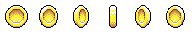
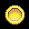
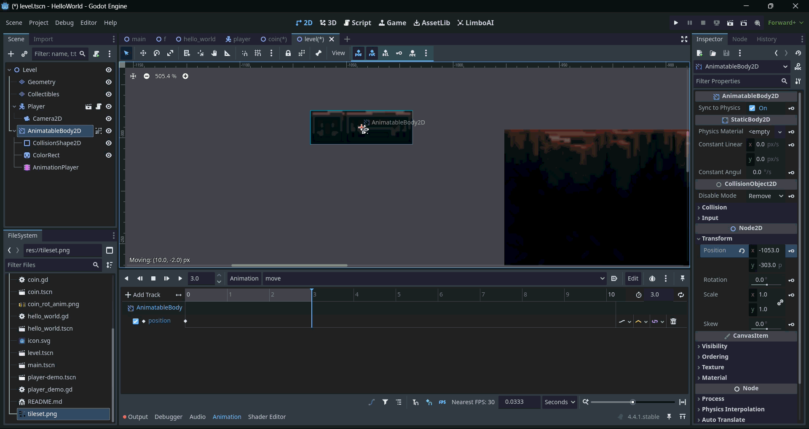

Animation is a powerful tool for bringing a game to life. While static images are serviceable for prototyping, animated images provide a greater sense of movement and feedback to the player. Godot offers two options for handling animations:

* AnimatedSprite2D
* AnimationPlayer

We'll use both of these Nodes for different applications. Let's start with the most straightforward option.

## AnimatedSprite2D

The AnimatedSprite2D is similar to the Sprite2D we have been using. The key difference is that the AnimatedSprite2D can change the image displayed rapidly during the game. This is important as traditional 2D animation is achieved by presenting many different images, which are called frames, in a rapid enough succession to create an illusion of movement. For video game assets these images are often collected into a single image called a *sprite sheet*. Below is an example of a coin sprite sheet:



If we take every frame of this image, the individual coins, and cycle through them fast enough we'll get a rotating coin:



AnimatedSprite2D allows us to do just that! First, we'll need to add an AnimatedSprite2D to our scene, then we need to add a SpriteFrames resource to the AnimatedSprite2D in the inspector:


We can then open the SpriteFrames by clicking on the SpriteFrames resource in the inspector. This will open an editor at the bottom of the screen:


Here we can add new animations. Let's make a new animation called "rotating" really quick. First, we'll click the paper with a plus icon in the SpriteFrames editor:


This will add a new animation named "new_animation" to the animation list. Let's rename it to "rotating" by double clicking it:


Then we can add new frames to this animation from a sprite sheet by clicking the "Add frames from sprite sheet" button. It looks a little bit like a waffle:


This will open a dialogue where we can select our spritesheet from:


This will open another editor. Here we can select the frames from our sprite sheet. First we'll need to change the horizontal columns and vertical rows to the correct amount for our sprite sheet. The coin sprite sheet has one vertical row and six horizontal columns (the six coin images). We can change this at the upper right of the editor:


Then we can select the frames we want to add to the animation by clicking them. This will highlight them and display a number. This number is the order that the frames will be played by the AnimatedSprite2D starting from 0: 


Once we've selected our frames we can click "Add Frame(s)". We should now be able to see our frames added to the editor:


However, we don't see our animation playing yet. We can preview our animation by clicking the play button in the animation editor:


This animation should play by default. We can set an animation to play by default by pressing the "Autoplay on Load" button:


Often we will want to change animations. For instance, we may have a character that needs to alternate between idle, running, jumping, and falling animations. We can do this by bringing a reference to our AnimatedSprite2D into our script and using the play() method to change the current animation. The play() method takes the name of the animation to be played as an argument. Here's an example of what that code would look like:

```gdscript
animated_sprite_2d.play("run")
animated_sprite_2d.play("jump")
animated_sprite_2d.play("idle")
animated_sprite_2d.play("fall")
```

## AnimationPlayer

Sometimes we will want to animate other things besides a sprite. We may want a platform that moves back and forth between two positions. We can do this using the AnimationPlayer and an AnimatableBody2D. The AnimationPlayer works differently than the AnimatedSprite2D. Instead of doing frame by frame animation, it instead has a timeline that we can add *keyframes* to. A keyframe is an important point in an animation. The AnimationPlayer the *interpolates* between the keyframes. An AnimatableBody2D is a special kind of StaticBody2D made to specifically be used with an AnimationPlayer. Below is how we would set up an AnimatableBody2D:


We can then add a new animation by clicking the AnimationPlayer and clicking on the "Animation" button in the editor that opens at the bottom of the screen, and clicking "new animation":


This will add a timeline to our editor. We can add tracks to the animation player by clicking the "Add Track" button. Tracks are the elements that we will *animate*. Typically this will be an object's properties. If select a Node and and look in the inspector while the AnimationPlayer is active we should see key symbols by every property. Here's what the AnimatableBody2D's inspector would look like:


For a moving platform we would want to animate our AnimatableBody2D's position property. If we click the key next to the position property we will add a new property track to the AnimationPlayer:


We can then change the length of the animation. This would control how long it will take our platform to reach its destination. This is found at the right side of the editor. I've set the animation to be 3 seconds long:


We can then add a new keyframe to the timeline by first moving the blue playhead to our desired time in the animation. I want the next frame to be at the end of the animation so I will drag the playhead to the 3 second mark:


Then, we will *move* the AnimatableBody2D to the position that we want it to move to in the viewport itself. 



Finally, we'll click the key next to the position property of the AnimatableBody2D again to create the keyframe. If we've done this correctly when we press the play button our platform should move!:


We can set it to loop the animation by enabling the loop mode. We can enable it by pressing the "Animation Looping" button by the timeline length. We can change the looping mode by clicking the "Animation Looping" button again. We'll select the "ping pong" mode which will make the animation play backward when it reaches the end and forward once it gets back to the beginning:


We can also set it to automatically start by enabling the "Auotplay on Load" button:


## Now it's your turn!

In your platformer project do the following:

1. Create the following animations for your player:
	1. Run
	2. Idle, set this to Autoplay on Load
	3. Jump
	4. Fall
2. Using AnimatedSprite2Ds, create the animations for each enemy and set them to Autoplay on Load
3. In your player script, do the following:
	1. Play the run animation when you enter the run state
	2. Play the jump animation when you enter the jump state
	3. Play the idle animation when you enter the idle state
	4. Play the fall animation when you enter the fall state
4. Add 2 moving platforms to *each* of your level seens
5. Add a coin animation to your collectible and set it to Autoplay on Load


